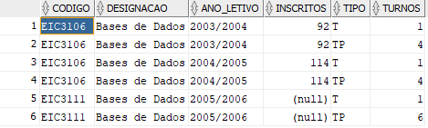
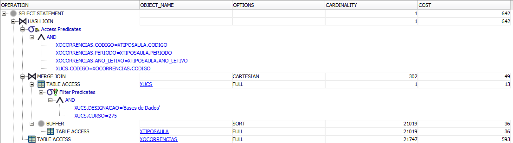
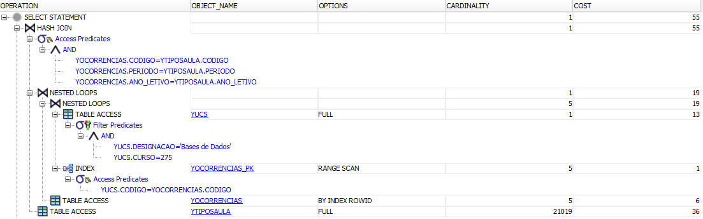
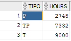
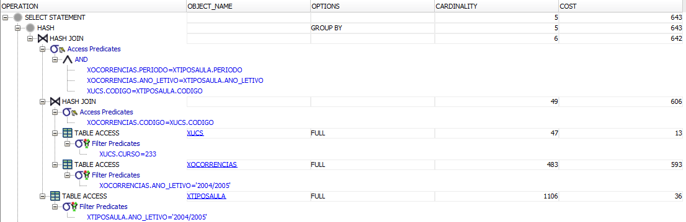
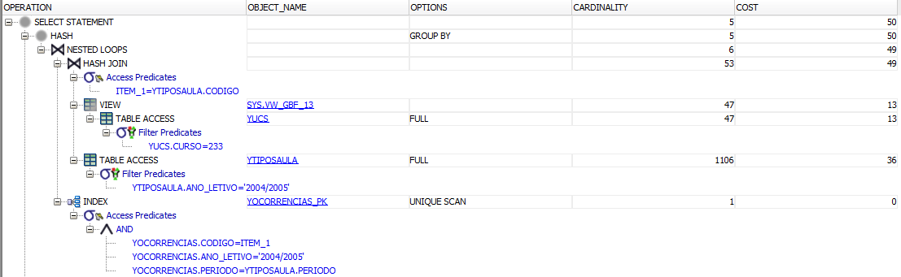

# Qirby Optimisation

## Query 1 - Select and Join
Show the codigo, designacao, ano_letivo, inscritos, tipo, and turnos for the course 'Bases de Dados' of the program 275.

**SQL Query**
```sql
SELECT CODIGO, DESIGNACAO, ANO_LETIVO, INSCRITOS, TIPO, TURNOS
    FROM XUCS
        INNER JOIN XOCORRENCIAS USING(CODIGO)
        INNER JOIN XTIPOSAULA USING (ANO_LETIVO, PERIODO, CODIGO)
    WHERE DESIGNACAO = 'Bases de Dados' AND CURSO = 275;
```

**Result**



**Execution Plan**

*X-Environment*


*Y-Environment*



## Query 2 - Aggregation
How many class hours of each type did the program 233 planned in year 2004/2005?

**SQL Query**
```sql
SELECT TIPO, 
    SUM(COALESCE(N_AULAS, 1) * HORAS_TURNO * DECODE(PERIODO /*EXPR*/,
                   '1S', 6, /*SEARCH, RESULT*/
                   '2S', 6,
                   '1T', 3,
                   '2T', 3,
                   '3T', 3,
                   '4T', 3,
                   'T', 3,
                   'A', 12,
                   'B', 2,
                   6 /*DEFAULT*/) * 4) AS HOURS
FROM XOCORRENCIAS
    INNER JOIN XUCS USING (CODIGO)
    INNER JOIN XTIPOSAULA USING (CODIGO, ANO_LETIVO, PERIODO)
WHERE
    ANO_LETIVO = '2004/2005'
    AND CURSO = '233'
GROUP BY TIPO;
```

**Result**

  

**Execution Plan**

*X-Environment*


*Y-Environment*


## Query 3 - Negation
Which courses (show the code) did have occurrences planned but did not get service assigned in year 2003/2004?