# Qirby Optimisation

## Query 1 - Select and Join
Show the codigo, designacao, ano_letivo, inscritos, tipo, and turnos for the course 'Bases de Dados' of the program 275.

**SQL Query**
```sql
SELECT CODIGO, DESIGNACAO, ANO_LETIVO, INSCRITOS, TIPO, TURNOS
    FROM XUCS
        INNER JOIN XOCORRENCIAS USING(CODIGO)
        INNER JOIN XTIPOSAULA USING (ANO_LETIVO, PERIODO, CODIGO)
    WHERE DESIGNACAO = 'Bases de Dados' AND CURSO = 275;
```

**Result**


**Execution Plan**

*X-Environment*


*Y-Environment*


## Query 2 - Aggregation
How many class hours of each type did the program 233 planned in year 2004/2005?

**SQL Query**
```sql
SELECT TIPO, 
    SUM(COALESCE(N_AULAS, 1) * HORAS_TURNO * DECODE(PERIODO /*EXPR*/,
                   '1S', 6, /*SEARCH, RESULT*/
                   '2S', 6,
                   '1T', 3,
                   '2T', 3,
                   '3T', 3,
                   '4T', 3,
                   'T', 3,
                   'A', 12,
                   'B', 2,
                   6 /*DEFAULT*/) * 4) AS HOURS
FROM XOCORRENCIAS
    INNER JOIN XUCS USING (CODIGO)
    INNER JOIN XTIPOSAULA USING (CODIGO, ANO_LETIVO, PERIODO)
WHERE
    ANO_LETIVO = '2004/2005'
    AND CURSO = '233'
GROUP BY TIPO;
```

**Result**

  

**Execution Plan**

*X-Environment*


*Y-Environment*


## Query 3 - Negation
Which courses (show the code) did have occurrences planned but did not get service assigned in year 2003/2004?

### Case A - Using `NOT IN`

**SQL Query**
```sql
SELECT CODIGO
    FROM XUCS
        INNER JOIN XOCORRENCIAS USING (CODIGO)
    WHERE ANO_LETIVO = '2003/2004'
        AND CODIGO NOT IN (
            SELECT CODIGO
                FROM XTIPOSAULA
                    INNER JOIN XDSD USING (ID)
                WHERE ANO_LETIVO = '2003/2004'
        );
```

**Result**

138 unique values

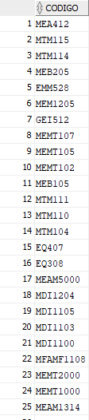
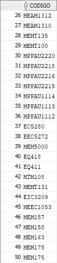
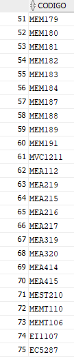
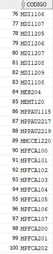
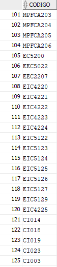
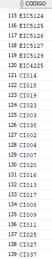  

**Execution Plan**

*X-Environment*
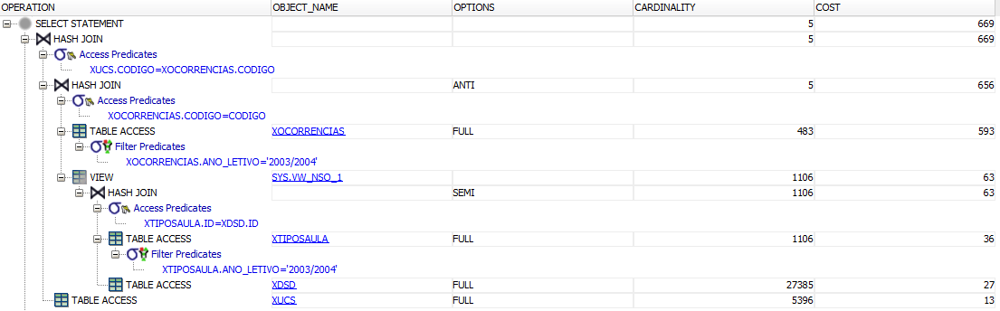

*Y-Environment*
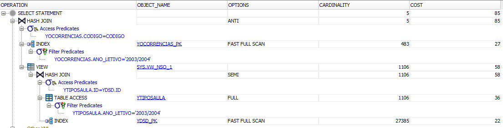

### Case B - Using `OUTER JOIN` and `IS NULL`

**SQL Query**
```sql
SELECT XUCS.CODIGO AS CODIGO
    FROM XUCS
        INNER JOIN XOCORRENCIAS ON XUCS.CODIGO = XOCORRENCIAS.CODIGO
        LEFT OUTER JOIN (
            SELECT CODIGO
                FROM XTIPOSAULA
                    INNER JOIN XDSD USING (ID)
                WHERE ANO_LETIVO = '2003/2004'
        ) temp ON XUCS.CODIGO = temp.CODIGO
    WHERE ANO_LETIVO = '2003/2004' AND temp.CODIGO IS NULL;
```

**Result**

Same result as case A.

**Execution Plan**

*X-Environment*
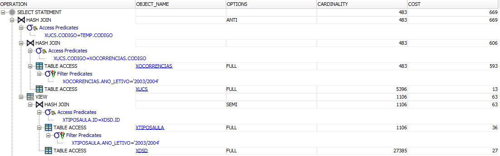

*Y-Environment*
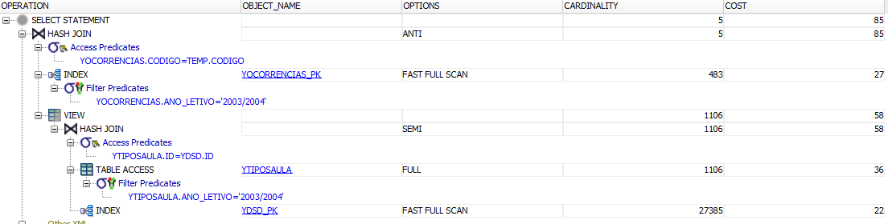

## Query 4
Who is the professor with more class hours for each type of class, in the academic year 2003/2004? Show the number and name of the professor, the type of class and the total of class hours times the factor.

**SQL Query**
```sql
WITH AUX (NR, NOME, TIPO, HOURS) AS (
    SELECT NR, NOME, TIPO,
            SUM(HORAS * DECODE(PERIODO /*EXPR*/,
                    '1S', 6, /*SEARCH, RESULT*/
                    '2S', 6,
                    '1T', 3,
                    '2T', 3,
                    '3T', 3,
                    '4T', 3,
                    'T', 3,
                    'A', 12,
                    'B', 2,
                    6 /*DEFAULT*/) * 4) AS HOURS
        FROM XDOCENTES
            INNER JOIN XDSD USING(NR)
            INNER JOIN XTIPOSAULA USING(ID)
            INNER JOIN XOCORRENCIAS USING(CODIGO, ANO_LETIVO, PERIODO)
        WHERE ANO_LETIVO = '2003/2004'
        GROUP BY (TIPO, NR, NOME)
)
SELECT NR, NOME, TIPO, HOURS
    FROM AUX
        INNER JOIN (
            SELECT TIPO, MAX(HOURS) AS HOURS
                FROM AUX
                GROUP BY TIPO
        ) USING (TIPO, HOURS);
```

**Result**

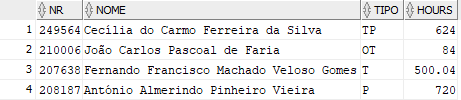

**Execution Plan**

*X-Environment*
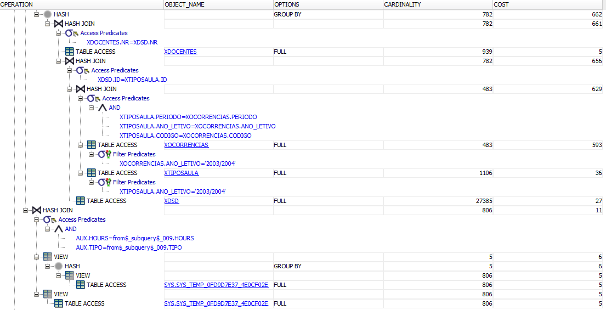

*Y-Environment*
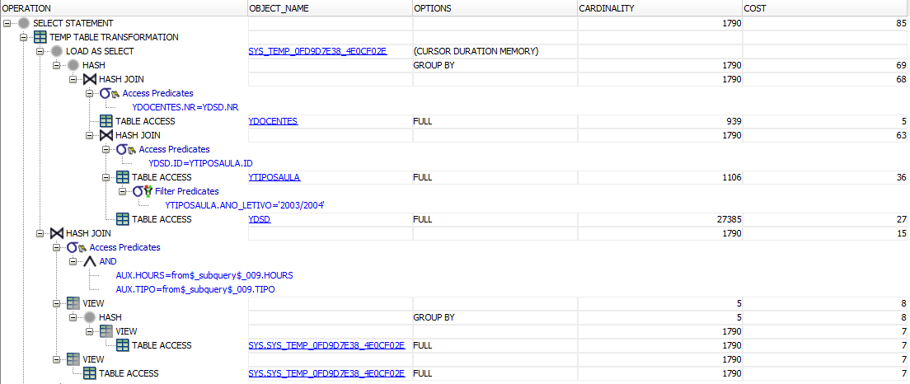

## Query 5
Compare the execution plans (just the environment Z) and the index sizes for the query giving the course code, the academic year, the period, and number of hours of the type 'OT' in the academic years of 2002/2003 and 2003/2004.

### Case A - Using `B-tree`

**SQL Query**
```sql
CREATE INDEX BTREE_5 ON ZTIPOSAULA(ANO_LETIVO, TIPO);

SELECT CODIGO, ANO_LETIVO, PERIODO, SUM(COALESCE(N_AULAS, 1) * HORAS_TURNO * DECODE(PERIODO /*EXPR*/,
                                                    '1S', 6, /*SEARCH, RESULT*/
                                                    '2S', 6,
                                                    '1T', 3,
                                                    '2T', 3,
                                                    '3T', 3,
                                                    '4T', 3,
                                                    'T', 3,
                                                    'A', 12,
                                                    'B', 2,
                                                    6 /*DEFAULT*/) * 4) AS HOURS
    FROM ZOCORRENCIAS
        INNER JOIN ZTIPOSAULA USING (CODIGO, ANO_LETIVO, PERIODO)
    WHERE TIPO = 'OT' AND (
        ANO_LETIVO = '2002/2003' OR ANO_LETIVO = '2003/2004'
    );

DROP INDEX BTREE_5;
```

**Result**

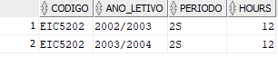

**Execution Plan**

*Z-Environment*


### Case B - Using `Bitmap`

**SQL Query**
```sql
CREATE BITMAP INDEX BITMAP_5 ON ZTIPOS(ANO_LETIVO, TIPO);

SELECT CODIGO, ANO_LETIVO, PERIODO, SUM(COALESCE(N_AULAS, 1) * HORAS_TURNO * DECODE(PERIODO /*EXPR*/,
                                                    '1S', 6, /*SEARCH, RESULT*/
                                                    '2S', 6,
                                                    '1T', 3,
                                                    '2T', 3,
                                                    '3T', 3,
                                                    '4T', 3,
                                                    'T', 3,
                                                    'A', 12,
                                                    'B', 2,
                                                    6 /*DEFAULT*/) * 4) AS HOURS
    FROM ZOCORRENCIAS
        INNER JOIN ZTIPOSAULA USING (CODIGO, ANO_LETIVO, PERIODO)
    WHERE TIPO = 'OT' AND (
        ANO_LETIVO = '2002/2003' OR ANO_LETIVO = '2003/2004'
    )
    GROUP BY (CODIGO, ANO_LETIVO, PERIODO);

DROP INDEX BITMAP_5;
```

**Result**

Same as case A.

**Execution Plan**

*Z-Environment*


## Query 6
Select the programs (curso) that have classes with all the existing types.

**SQL Query**
```sql
SELECT CURSO
FROM XOCORRENCIAS
    INNER JOIN XUCS USING (CODIGO)
    INNER JOIN XTIPOSAULA USING (CODIGO, ANO_LETIVO, PERIODO)
GROUP BY CURSO
HAVING COUNT(DISTINCT TIPO) = 5;

-- without hard coded value on the number of distinct types
SELECT CURSO
FROM XOCORRENCIAS
    INNER JOIN XUCS USING (CODIGO)
    INNER JOIN XTIPOSAULA USING (CODIGO, ANO_LETIVO, PERIODO)
GROUP BY CURSO
HAVING COUNT(DISTINCT TIPO) = (
        SELECT COUNT(DISTINCT TIPO)
        FROM XTIPOSAULA);
```

**Result**

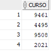

**Execution Plan**

*Z-Environment*

