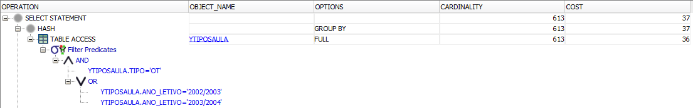

# Qirby Optimisation

## Extra Indexes
For the creation of extra indexes on the Z environment, multiple criteria were used to decide whether to create an index over that column, criteria such as:
- Usage of the column to merge tables (`JOIN` statements);
- Usage of the column to filter tables (`WHERE` statements);
- Usage of the column to aggregate tables (`GROUP BY` statements);

Furthermore, other criteria were used to decide the type of index, such as:
- Cardinality of the column;

A list of candidate columns for indexes was created that consisted on:
- `ANO_LETIVO, PERIODO, CODIGO` - used to join tables on all queries that require to calculate number of hours and other information involving table `XOCORRENCIAS` and `XTIPOSAULA`;
- `TIPO` - used extensively for aggregating data based on the type of occurrence and to filter data;
- `ANO_LETIVO` - used vastly for filtering tables;
- `CURSO` - used for filtering and aggregation on half the queries;
- `CODIGO` - used for joining tables;
- `ID` - used for joining tables;

To decide on the type of index to be created, we studied the statistics of the columns to help with the decision:
- `CODIGO, ANO_LETIVO, PERIODO` - This composite is almost completely unique, and for that reason the `BITMAP` index wasn't even considered. This index will be created as a `B-Tree` index.
- `TIPO` - Low cardinality column, only having 5 distinct values out of over 20k rows, and furthermore, the column is stable. For these reasons, it was opted to create a `BITMAP` index.
- `ANO_LETIVO` - Based on the low cardinality of this column, the slow growth of unique values (only once a year) and the types of queries we have, it was decided to create a `BITMAP` index on this column, on both `TIPOSAULA` and `OCORRENCIAS` tables. However, when comparing execution plans, a `BITMAP` index on this column wouldn't be used as opposed to a `B-Tree` index, due to the need of performing range scans. `B-tree` index comes at the cost of using approximately 10x more space (0.5625MB vs 0.0625MB). Therefore, it was opted to use a `B-tree` index even with criteria pointing to a `BITMAP` index, as the former affected more queries than the latter.
- `CURSO` - This column has a low cardinality (2:100), which is higher than the threshold considered (1:100). However, due to the stability of this table, as the table is never changed unless a restructure of the UCs is made, we opted to use a `BITMAP` index.
- `CODIGO` - This column is a leading column on another index (primary key of `OCORRENCIAS`), therefore the creation of index in this column is redundant and wasn't performed;
- `ID` - Column possesses a huge number of distinct values, therefore the only index that was considered was the `B-Tree` index.

Thus, the indexes created were:
- **cap_idx** - `B-tree` index on columns `CODIGO, ANO_LETIVO, PERIODO` of table `ZTIPOSAULA`
```sql
CREATE INDEX cap_idx ON ZTIPOSAULA(CODIGO, ANO_LETIVO, PERIODO);
```

- **tipo_idx** - `Bitmap` index on column `TIPO` of table `ZTIPOSAULA`
```sql
CREATE BITMAP INDEX tipo_idx ON ZTIPOSAULA(TIPO);
```

- **ano_tp_idx** & **ano_oc_idx** - `B-tree` index on column `ANO_LETIVO` of table `ZTIPOSAULA` and on column `ANO_LETIVO` of table `ZOCORRENCIAS`
```sql
CREATE INDEX ano_tp_idx ON ZTIPOSAULA(ANO_LETIVO);
CREATE INDEX ano_oc_idx ON ZOCORRENCIAS(ANO_LETIVO);
```

- **curso_idx** - `Bitmap` index on column `CURSO` of table `ZUCS`
```sql
CREATE BITMAP INDEX curso_idx ON ZUCS(CURSO);
```

- **id_idx** - `B-tree` index on column `ID` of table `ZDSD`
```sql
CREATE INDEX id_idx ON ZDSD(ID);
```

## Query 1 - Select and Join
Show the codigo, designacao, ano_letivo, inscritos, tipo, and turnos for the course 'Bases de Dados' of the program 275.

**SQL Query**
```sql
SELECT CODIGO, DESIGNACAO, ANO_LETIVO, INSCRITOS, TIPO, TURNOS
    FROM XUCS
        INNER JOIN XOCORRENCIAS USING(CODIGO)
        INNER JOIN XTIPOSAULA USING (ANO_LETIVO, PERIODO, CODIGO)
    WHERE DESIGNACAO = 'Bases de Dados' AND CURSO = 275;
```

**Result**


**Execution Plan**

As can be seen in the execution plans below, the X environment presents the highest costs for the query, as expected. This is due to the non-existence of indexes as compared to Y (has indexes created from primary keys) and Z (has primary key indexes and extra indexes), which causes the query to perform full accesses to the tables. In the Y environment, this cost is optimised due to the existence of indexes created from the primary keys, reducing the cost of access on tables and also on the join of the tables (as can be seen on the join between `YUCS` and `YOCORRENCIAS`).

In the Z environment, the query is further optimised due to the creation of the index `cap_idx` on `ZTIPOSAULA` which permitted a more efficient join with the `ZOCORRENCIAS` table, cutting a lot of the cost from the Y environment. The existence of the `curso_idx` index also helped when filtering the table `ZUCS` for the course `275`.

**Cost optimisation in comparison to X environment**
|  X 	|    Y   	| Z    	|
|:--:	|:------:	|------	|
| 0% 	| -91.4% 	| -97% 	|

*X-Environment*


*Y-Environment*


*Z-Environment*


## Query 2 - Aggregation
How many class hours of each type did the program 233 planned in year 2004/2005?

**SQL Query**
```sql
SELECT TIPO, 
    SUM(COALESCE(N_AULAS, 1) * HORAS_TURNO * DECODE(PERIODO /*EXPR*/,
                   '1S', 6, /*SEARCH, RESULT*/
                   '2S', 6,
                   '1T', 3,
                   '2T', 3,
                   '3T', 3,
                   '4T', 3,
                   'T', 3,
                   'A', 12,
                   'B', 2,
                   6 /*DEFAULT*/) * 4) AS HOURS
FROM XOCORRENCIAS
    INNER JOIN XUCS USING (CODIGO)
    INNER JOIN XTIPOSAULA USING (CODIGO, ANO_LETIVO, PERIODO)
WHERE
    ANO_LETIVO = '2004/2005'
    AND CURSO = '233'
GROUP BY TIPO;
```

**Result**

  

**Execution Plan**

As can be seen in the execution plans below, the X environment presents the highest costs for the query, as expected. This is due to the non-existence of indexes as compared to Y (has indexes created from primary keys) and Z (has primary key indexes and extra indexes), which causes the query to perform full accesses to the tables. In the Y environment, this cost is optimised due to the existence of indexes created from the primary keys, reducing the cost of access on tables and also on the join of the tables (as can be seen on the hash join operation between the tables).

The Z-environment is further optimised because of the creation of indexes `cap_idx` and `ano_tp_idx` which enable a more efficient join and filter of tables, respectively.

**Cost optimisation in comparison to X environment**
|  X 	|    Y   	| Z      	|
|:--:	|:------:	|--------	|
| 0% 	| -92.2% 	| -92.7% 	|

*X-Environment*


*Y-Environment*


*Z-Environment*


## Query 3 - Negation
Which courses (show the code) did have occurrences planned but did not get service assigned in year 2003/2004?

### Case A - Using `NOT IN`

**SQL Query**
```sql
SELECT CODIGO
    FROM XUCS
        INNER JOIN XOCORRENCIAS USING (CODIGO)
    WHERE ANO_LETIVO = '2003/2004'
        AND CODIGO NOT IN (
            SELECT CODIGO
                FROM XTIPOSAULA
                    INNER JOIN XDSD USING (ID)
                WHERE ANO_LETIVO = '2003/2004'
        );
```

**Result**

138 unique values


  

**Execution Plan**

As can be seen in the execution plans below, the X environment presents the highest costs for the query, as expected. This is due to the non-existence of indexes as compared to Y (has indexes created from primary keys) and Z (has primary key indexes and extra indexes), which causes the query to perform full accesses to the tables. In the Y environment, this cost is optimised due to the existence of indexes created from the primary keys, reducing the cost of access to tables and also on the join of the tables (mainly seen on the fast full scan performed on the `YOCORRENCIAS` instead of a full scan).

On Z-environment, the query is further optimised due to the creation of the index `ano_tp_idx` that improved the cost-effectiveness of the filtering of `ZTIPOSAULA` table. Another minor optimisation was due to the creation of the index `id_idx` which reduced the cost of the fast full scan on `YDSD` table, however this reduction was minor as the previous environment already had used the index created by the primary key to optimise this scan.

**Cost optimisation in comparison to X environment**
|  X 	|    Y   	| Z      	|
|:--:	|:------:	|--------	|
| 0% 	| -87.3% 	| -88.6% 	|

*X-Environment*


*Y-Environment*


*Z-Environment*


### Case B - Using `OUTER JOIN` and `IS NULL`

**SQL Query**
```sql
SELECT XUCS.CODIGO AS CODIGO
    FROM XUCS
        INNER JOIN XOCORRENCIAS ON XUCS.CODIGO = XOCORRENCIAS.CODIGO
        LEFT OUTER JOIN (
            SELECT CODIGO
                FROM XTIPOSAULA
                    INNER JOIN XDSD USING (ID)
                WHERE ANO_LETIVO = '2003/2004'
        ) temp ON XUCS.CODIGO = temp.CODIGO
    WHERE ANO_LETIVO = '2003/2004' AND temp.CODIGO IS NULL;
```

**Result**

Same result as case A.

**Execution Plan**

Judging from the execution plan, the Oracle SQL environment optimised the query performed that resulted on the exact same execution plan as case A, and therefore all the conclusions explained above apply the same for this case.

**Cost optimisation in comparison to X environment**
|  X 	|    Y   	| Z      	|
|:--:	|:------:	|--------	|
| 0% 	| -87.3% 	| -88.6% 	|

*X-Environment*


*Y-Environment*


*Z-Environment*


## Query 4
Who is the professor with more class hours for each type of class, in the academic year 2003/2004? Show the number and name of the professor, the type of class and the total of class hours times the factor.

**SQL Query**
```sql
WITH AUX (NR, NOME, TIPO, HOURS) AS (
    SELECT NR, NOME, TIPO,
            SUM(HORAS * DECODE(PERIODO /*EXPR*/,
                    '1S', 6, /*SEARCH, RESULT*/
                    '2S', 6,
                    '1T', 3,
                    '2T', 3,
                    '3T', 3,
                    '4T', 3,
                    'T', 3,
                    'A', 12,
                    'B', 2,
                    6 /*DEFAULT*/) * 4) AS HOURS
        FROM XDOCENTES
            INNER JOIN XDSD USING(NR)
            INNER JOIN XTIPOSAULA USING(ID)
            INNER JOIN XOCORRENCIAS USING(CODIGO, ANO_LETIVO, PERIODO)
        WHERE ANO_LETIVO = '2003/2004'
        GROUP BY (TIPO, NR, NOME)
)
SELECT NR, NOME, TIPO, HOURS
    FROM AUX
        INNER JOIN (
            SELECT TIPO, MAX(HOURS) AS HOURS
                FROM AUX
                GROUP BY TIPO
        ) USING (TIPO, HOURS);
```

**Result**


**Execution Plan**

As can be seen in the execution plans below, the X environment presents the highest costs for the query, as expected. This is due to the nonexistance of indexes as compared to Y (has indexes created from primary keys) and Z (has primary key indexes and extra indexes), which causes the query to perform full accesses to the tables. In the Y environment, this cost is optimised due to the existence of indexes created from the primary keys, reducing the cost of access on tables and also on the join of the tables (as can be seen on the hash join operation between the tables).

The Z-environment is slightly optimised thanks to the `ano_tp_idx` index, which allowed for a range scan instead of a full scan.

**Cost optimisation in comparison to X environment**
|  X 	|    Y   	| Z      	|
|:--:	|:------:	|--------	|
| 0% 	| -87.1% 	| -87.5% 	|

*X-Environment*


*Y-Environment*


*Z-Environment*


## Query 5
Compare the execution plans (just the environment Z) and the index sizes for the query giving the course code, the academic year, the period, and number of hours of the type 'OT' in the academic years of 2002/2003 and 2003/2004.

**SQL Query**
```sql
SELECT CODIGO, ANO_LETIVO, PERIODO, SUM(COALESCE(N_AULAS, 1) * HORAS_TURNO * DECODE(PERIODO /*EXPR*/,
                                                    '1S', 6, /*SEARCH, RESULT*/
                                                    '2S', 6,
                                                    '1T', 3,
                                                    '2T', 3,
                                                    '3T', 3,
                                                    '4T', 3,
                                                    'T', 3,
                                                    'A', 12,
                                                    'B', 2,
                                                    6 /*DEFAULT*/) * 4) AS HOURS
    FROM XOCORRENCIAS
        INNER JOIN XTIPOSAULA USING (CODIGO, ANO_LETIVO, PERIODO)
    WHERE TIPO = 'OT' AND (
        ANO_LETIVO = '2002/2003' OR ANO_LETIVO = '2003/2004'
    )
    GROUP BY (CODIGO, ANO_LETIVO, PERIODO);

```

**Result**


**Execution Plan**

*X-Environment*


*Y-Environment*
  

### Case A - Using `B-tree`

**SQL Query**
```sql
CREATE INDEX BTREE_5 ON ZTIPOSAULA(ANO_LETIVO, TIPO);

SELECT CODIGO, ANO_LETIVO, PERIODO, SUM(COALESCE(N_AULAS, 1) * HORAS_TURNO * DECODE(PERIODO /*EXPR*/,
                                                    '1S', 6, /*SEARCH, RESULT*/
                                                    '2S', 6,
                                                    '1T', 3,
                                                    '2T', 3,
                                                    '3T', 3,
                                                    '4T', 3,
                                                    'T', 3,
                                                    'A', 12,
                                                    'B', 2,
                                                    6 /*DEFAULT*/) * 4) AS HOURS
    FROM ZOCORRENCIAS
        INNER JOIN ZTIPOSAULA USING (CODIGO, ANO_LETIVO, PERIODO)
    WHERE TIPO = 'OT' AND (
        ANO_LETIVO = '2002/2003' OR ANO_LETIVO = '2003/2004'
    );

DROP INDEX BTREE_5;
```

**Execution Plan**

*Z-Environment*


### Case B - Using `Bitmap`

**SQL Query**
```sql
CREATE BITMAP INDEX BITMAP_5 ON ZTIPOSAULA(ANO_LETIVO, TIPO);

SELECT CODIGO, ANO_LETIVO, PERIODO, SUM(COALESCE(N_AULAS, 1) * HORAS_TURNO * DECODE(PERIODO /*EXPR*/,
                                                    '1S', 6, /*SEARCH, RESULT*/
                                                    '2S', 6,
                                                    '1T', 3,
                                                    '2T', 3,
                                                    '3T', 3,
                                                    '4T', 3,
                                                    'T', 3,
                                                    'A', 12,
                                                    'B', 2,
                                                    6 /*DEFAULT*/) * 4) AS HOURS
    FROM ZOCORRENCIAS
        INNER JOIN ZTIPOSAULA USING (CODIGO, ANO_LETIVO, PERIODO)
    WHERE TIPO = 'OT' AND (
        ANO_LETIVO = '2002/2003' OR ANO_LETIVO = '2003/2004'
    )
    GROUP BY (CODIGO, ANO_LETIVO, PERIODO);

DROP INDEX BITMAP_5;
```

**Execution Plan**

*Z-Environment*


**Cost optimisation in comparison to X environment**
|  X 	|    Y   	| Z (A)  	| Z (B)  	|
|:--:	|:------:	|--------	|--------	|
| 0% 	| -94.1% 	| -99.2% 	| -97.3% 	|

The index sizes were obtained via this SQL statement:
```sql
select sum(bytes)/1024/1024 as "Index Size (MB)" from user_segments where segment_name='BTREE_5';

select sum(bytes)/1024/1024 as "Index Size (MB)" from user_segments where segment_name='BITMAP_5';
```

|  BTREE 	|    BITMAP   	|
|:--:	    |:------:	    |
| 0.625MB 	| 0.0625MB 	    |

`B-tree` allows for a more efficient way to fetch the results via a range scan on the index. The `Bitmap` suffers on the cost optimisation due to having to convert the existing indexes into `Bitmap` index to perform the operations, this could be avoided by making the indexes `ano_tp_idx` a bitmap index, however it would make other queries less cost-efficient.

From these, we can take the usual trade-off of `cost vs space`, as the `B-tree` index allows for a better cost optimisation (approximately 3x less cost than `Bitmap` index), however it comes with the cost of taking 10x more space to store the index.

## Query 6
Select the programs (curso) that have classes with all the existing types.

**SQL Query**
```sql
SELECT CURSO
FROM XOCORRENCIAS
    INNER JOIN XUCS USING (CODIGO)
    INNER JOIN XTIPOSAULA USING (CODIGO, ANO_LETIVO, PERIODO)
GROUP BY CURSO
HAVING COUNT(DISTINCT TIPO) = 5;

-- without hard coded value on the number of distinct types
SELECT CURSO
FROM XOCORRENCIAS
    INNER JOIN XUCS USING (CODIGO)
    INNER JOIN XTIPOSAULA USING (CODIGO, ANO_LETIVO, PERIODO)
GROUP BY CURSO
HAVING COUNT(DISTINCT TIPO) = (
        SELECT COUNT(DISTINCT TIPO)
        FROM XTIPOSAULA);
```

**Result**


**Execution Plan**

As can be seen in the execution plans below, the X environment presents the highest costs for the query, as expected. This is due to the non-existence of indexes as compared to Y (has indexes created from primary keys) and Z (has primary key indexes and extra indexes), which causes the query to perform full accesses to the tables. In the Y environment, this cost is optimised due to the existence of indexes created from the primary keys, reducing the cost of access to tables and also on the join of the tables (as can be seen on the hash join operation between the tables).

However, our indexes didn't further optimise this query, staying with the same execution plan and the same cost for query.

**Cost optimisation in comparison to X environment**
|  X 	|    Y   	| Z      	|
|:--:	|:------:	|--------	|
| 0% 	| -91.9% 	| -91.9% 	|

*X-Environment*


*Y-Environment*


*Z-Environment*


## Overall System Cost Optimisation

|  X 	|    Y   	| Z      	|
|:--:	|:------:	|--------	|
| 0% 	| -90.7% 	| -92.8% 	|
